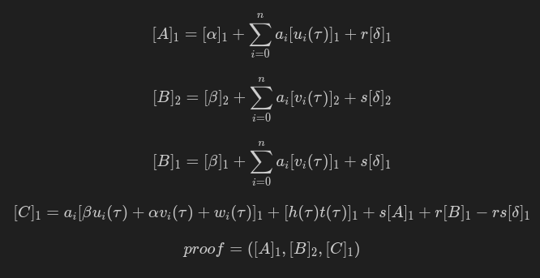

# Groth16-zkSnark

This repository implements a Groth16 ZKSNARK for a Valid Witness to Polynomial Constraint.

The Groth16 algorithm computes ZKSNARKS, a succinct zero knowledge proof system that enables a prover to prove to a verifier that they have performed an agreed upon program correctly and recieved a claimed output without revealing any information about their inputs to the program or the intermediate state of computation. 

In our case, the agreed upon program is the following polynomial constraint:

$$
40 = x^3 - 4x^2 + 6x + y^2
$$

Using the Snark in this repository, I can verifiably prove to you that I know an $x$ and $y$ that satisfy the above equation without revealing anything other than that claim. 

Not only that, but the verification step is succinct. Meaning that the verifier can validate the proof with $O(1)$ time complexity. Making this algorithm especially useful in situations where the verifier is resource constrained, such as on a blockchain.

# Implementation Details

### Example:

[test_Groth16.py](test_Groth16.py) contains an example of how to use the python code in the [src](src) directory to generate a proof and verify it.
### src/

[QAP.py](src/QAP.py) contains the polynomial constaint program. It is represented originally as an R1CS and transformed into a QAP for use in the Groth16 algorithm.

[trusted_setup.py](src/trusted_setup.py) contains the trusted setup for the Groth16 algorithm. It generates random secret parameters used to make the proof zero knowledge to both the prover and verifier.

[prover.py](src/prover.py) contains the Groth16 prover. It uses parameters from the trusted setup to generate a proof of knowledge of a valid witness to the polynomial constraint.

[verifier.py](src/verifier.py) contains the code for the Groth16 verifier. It uses the trusted setup and the proof generated by the prover to verify that the knowledge of the solution to the constaint.

### Dependencies 

    pip install numpy py_ecc galois

# How Groth16 Snarks Work...

Below I am going to breifly explain how Groth16 snarks work. The below explanation assumes a basic understanding of elliptic curve cryptography, modular arithmatic, and abstract algebra.
It is a super condensed version of this already [super condensed book](https://www.rareskills.io/zk-book) on snarks.


### The Program and our Goal

As mentioned above, our initial program is defined as the following polynomial constaint:

$$
40 = x^3 - 4x^2 + 6x + y^2
$$

Our goal is prove that we have run this program with inputs that satisfy the equation without revealing anything except that claim.

### Algebraic Circuits

To do this, we first need to represent the program as an algebraic circuit. This just means we refactor the above polynomial into a series of contrainst with only 1 quadratic term (ie one multiplication per line):

$$
v1 = x*x
$$

$$
v2 = v1*x
$$


$$
v3 = 4x*x
$$


$$
out = v1 + v2 + y*y
$$

Given $x=3$ and $y=2$ the ouput of the above circuit would be $40$.

### Rank 1 Constraint Systems

Next we must further modify the algebraic circuit above into a Rank 1 Constaint System. An R1CS is a system of linear equations representing an algebraic circuit:

$$
Ls \circ Rs = Os
$$


Where $L, R$ are matrices representing the left and right hand sides of each quadratic constraint, $O$ is a matrix representing the output of each quadratic constraint, and $s$ is the witness. $\circ$ is the hadamard product.

The *witness*, denoted as $s$, is a vector containing all inputs, intermediate computation, and the output of the program when run. The *witness* is the only thing that the prover knows and the verifier does not.


Our R1CS matrices and witness for the program are:

```math
L = \begin{bmatrix}
l{}_{1,1} & l{}_{1,out} & l{}_{1,x} & l{}_{1,y} & l{}_{1,v1} & l{}_{1,v2} & l{}_{1,v3} \\
l{}_{2,1} & l{}_{2,out} & l{}_{2,x} & l{}_{2,y} & l{}_{2,v1} & l{}_{2,v2}  & l{}_{2,v3} \\
l{}_{3,1} & l{}_{3,out} & l{}_{3,x} & l{}_{3,y} & l{}_{3,v1} & l{}_{3,v2} & l{}_{3,v3} \\
l{}_{4,1} & l{}_{4,out} & l{}_{4,x} & l{}_{4,y} & l{}_{4,v1} & l{}_{4,v2} & l{}_{4,v3} 
\end{bmatrix}

=

\begin{bmatrix}
0 & 0 & 1 & 0 & 0 & 0 & 0 \\
0 & 0 & 0 & 0 & 1 & 0 & 0 \\
0 & 0 & 4 & 0 & 0 & 0 & 0 \\
0 & 0 & 0 & 1 & 0 & 0 & 0 
\end{bmatrix}

```

```math
R = \begin{bmatrix}
r{}_{1,1} & r{}_{1,out} & r{}_{1,x} & r{}_{1,y} & r{}_{1,v1} & r{}_{1,v2} & r{}_{1,v3} \\
r{}_{2,1} & r{}_{2,out} & r{}_{2,x} & r{}_{2,y} & r{}_{2,v1} & r{}_{2,v2}  & r{}_{2,v3} \\
r{}_{3,1} & r{}_{3,out} & r{}_{3,x} & r{}_{3,y} & r{}_{3,v1} & r{}_{3,v2} & r{}_{3,v3} \\
r{}_{4,1} & r{}_{4,out} & r{}_{4,x} & r{}_{4,y} & r{}_{4,v1} & r{}_{4,v2} & r{}_{4,v3} 
\end{bmatrix}

=

\begin{bmatrix}
0 & 0 & 1 & 0 & 0 & 0 & 0 \\
0 & 0 & 1 & 0 & 0 & 0 & 0 \\
0 & 0 & 1 & 0 & 0 & 0 & 0 \\
0 & 0 & 0 & 1 & 0 & 0 & 0 
\end{bmatrix}

```

```math
O = \begin{bmatrix}
o{}_{1,1} & o{}_{1,out} & o{}_{1,x} & o{}_{1,y} & o{}_{1,v1} & o{}_{1,v2} & o{}_{1,v3} \\
o{}_{2,1} & o{}_{2,out} & o{}_{2,x} & o{}_{2,y} & o{}_{2,v1} & o{}_{2,v2}  & o{}_{2,v3} \\
o{}_{3,1} & o{}_{3,out} & o{}_{3,x} & o{}_{3,y} & o{}_{3,v1} & o{}_{3,v2} & o{}_{3,v3} \\
o{}_{4,1} & o{}_{4,out} & o{}_{4,x} & o{}_{4,y} & o{}_{4,v1} & o{}_{4,v2} & o{}_{4,v3} 
\end{bmatrix}

=

\begin{bmatrix}
0 & 0 & 0 & 0 & 1 & 0 & 0 \\
0 & 0 & 0 & 0 & 0 & 1 & 0 \\
0 & 0 & 0 & 0 & 0 & 0 & 1 \\
67 & 0 & 0 & 0 & 0 & -1 & -1 
\end{bmatrix}
```

```math
s = [1, 40, 3, 2, 9, 27, 12] = [constant, out, x, y, v1, v2, v3]

```

```math
Ls \circ Rs = Os
```

The rows of the matrices correspond to each constraint in the algebraic circuit. The non zero terms correspond to multiples of the variables in the witness. For example, the first row of $L$, $R$, and $O$ are an encoded version of $v1 = x*x$

The constant term in the witness is always 1. Which allows us to shunt all additions of the algebraic circuit into the final row of the R1CS.

### Quadratic Arithmetic Programs

It is possible to run a zero knowledge proof using the R1CS above by encrypting $L$, $R$, $O$, and $s$ into elliptic curve points (expept for the public claim of $out=40$ in $s$). Then having the verifier compute an encrypted evaluation of the R1CS with curve point additon and bilinear pairings and determining if the equality holds (I implemented this [here](https://github.com/Holindauer/R1CS-zkProof/tree/main)). However, this is extremely inneficient, especially for large circuits.

In order to make this representation succinct, we can transform the R1CS into a Quadratic Arithmetic Program (QAP). A QAP is a representation of the R1CS as a series of polynomials.


Our goal is to use a transformation function $\varphi$ to encode each R1CS matrix into vector of polynomials. This is a much more compact and flexible representation of the R1CS that will be useful in the Groth16 algorithm.

$$ 
U = \varphi(L) = [u_1(x), u_2(x),..., u_n(x)] L \in \mathbb{F_p}^{n \times m} 
$$

$u_n$ are polynomials of degree $n - 1$ that interpolate the columns of $L$. The next section will explain why this works and how its done.

### How Vectors are Encoded as Polynomials

There exists a [Ring](https://en.wikipedia.org/wiki/Ring_(mathematics)) Homomorphism from column vectors of dimension n with real number elements to polynomials with real coefficients. 
 
 Given $n$ points on a cartesian $(x, y)$ plane, an n dimmensional vector can be uniquely interpolated by a polynomial of degree $n - 1$. If the degree is not constrained, an infinite number of polynomials of degree $n - 1$ or higher can interpolate those points.

 For example, given the following column vector:
 
 ```math
 v = \begin{bmatrix} 4 \\ 12 \\ 6 \end{bmatrix}
 ```
 
 Using [lagrange interpolation](https://en.wikipedia.org/wiki/Lagrange_polynomial), we can encode the vector as:
 
 $$
 p(x) = -7x^2 + 29x - 18
 $$

 $$
 p(1) = 4
 $$

 $$
 p(2) = 12
 $$
 
 $$
 p(3) = 6
 $$


The ring homomorphism here means that there is an information/structure preserving transformation from vectors to polynomials. Vector addition and multiplication is preserved within the interpolation in the form of polynomial addition and multiplication.

### R1CS to QAP Transformation Function

Before going any further, it must be mentioned that from now on, the elements of our R1CS matrices must be converted into elements of a finite field $\mathbb{F_p}$. Specifically, a galois field with a matching field modulus to the elliptic curve we plan to use for our encryption.


Consider the case where $Ls$ is define as follows:

```math
Ls = \begin{bmatrix}
0 0 1 0 0 0 \\ 0 0 0 0 1 0 \\ 0 0 1 0 0 0 
\end{bmatrix}  

\begin{bmatrix} 1 \\ 18 \\ 2 \\ 3 \\ 4 \\ 12 \end{bmatrix} 

= \begin{bmatrix} 2 \\ 4 \\ 2 \end{bmatrix}
```


The matrix multiplication $Ls$ can be rewritten as a sum of hadamard products of column vectors as follows:

```math

Ls = \begin{bmatrix} 0 \\ 0 \\ 0 \end{bmatrix} 
\circ \begin{bmatrix} 1 \\ 1 \\ 1 \end{bmatrix} + 

\begin{bmatrix} 0 \\ 0 \\ 0 \end{bmatrix}
\circ \begin{bmatrix} 18 \\ 18 \\ 18 \end{bmatrix} +

\begin{bmatrix} 1 \\ 0 \\ 1 \end{bmatrix}
\circ \begin{bmatrix} 2 \\ 2 \\ 2 \end{bmatrix} +

\begin{bmatrix} 0 \\ 0 \\ 0 \end{bmatrix}
\circ \begin{bmatrix} 3 \\ 3 \\ 3 \end{bmatrix} +

\begin{bmatrix} 0 \\ 1 \\ 0 \end{bmatrix}
\circ \begin{bmatrix} 4 \\ 4 \\ 4 \end{bmatrix} +

\begin{bmatrix} 0 \\ 0 \\ 0 \end{bmatrix}
\circ \begin{bmatrix} 12 \\ 12 \\ 12 \end{bmatrix}

= \begin{bmatrix} 2 \\ 4 \\ 2 \end{bmatrix}

```


To transform the R1CS into a QAP, we will define a transformation function $\varphi$ that will perform lagrange interpolation on the columns of  $L, R, O$.


$$ 
U = \varphi(L) = [u_1(x), u_2(x),..., u_n(x)] L \in \mathbb{F_p}^{n \times m} 
$$

$$ 
V = \varphi(R) = [v_1(x), v_2(x),..., v_n(x)] R \in \mathbb{F_p}^{n \times m} 
$$

$$ 
W = \varphi(O) = [w_1(x), w_2(x),..., w_n(x)] O \in \mathbb{F_p}^{n \times m} 
$$

$$ 
s = a = (a_1, ... , a_n), a_1 = 1, a{}_{i, i>1} \in \mathbb{F_p} 
$$

Note that the interpolation of each row of the column vector maps to the dimension of that row - 1. And all arithmetic operations are done in the finite field $\mathbb{F_p}$.

The following equations are all congruent to our original program:

$$
40 = x^3 - 4x^2 + 6x + y^2
$$

$$
Ls \circ Rs = Os
$$

$$ 
(U \cdot s)(V \cdot s) = W \cdot s 
$$

$$ 
\sum_{i=0}^m a_iu_i(x) \sum_{i=0}^m a_iv_i(x) = \sum_{i=0}^m a_iw_i(x) 
$$

The QAP representaiton is what enables us to achieve succinctly verifiable proofs. The dot products above result in a single polynomial when computed, as opposed to very large matrices.

### Balancing the QAP

There is a catch to the above description of QAPs. Because we are multiplying $U \cdot s$ and $V \cdot s$, the degree of the resulting polynomial will not match that of $W \cdot s$. The integrity of the interpolation wrt to the R1CS will still hold, but something must be done to maintain the equality of the polynomial equation. They must be the same polynomial.

To illustrate this, consider the following setup for $U, V, W, s$

$$
(W \cdot s) = x^2 + 3x + 1
$$

$$
(U \cdot s) = x^2 + x + 1
$$

$$
(V \cdot s) = 3x^2 -2x +1
$$

$$
(U \cdot s)(V \cdot s) = 3x^4 + x^3 + 2x^2 - x + 1
$$

In this situation, $W \cdot s$ will only be a degree of 2, breaking the equality on the polynomial side of things. We need to introduce another term into the right hand side of the equation to return the equality.

First, lets consider our R1CS again. We wish to add a term without changing this representation. If we add the zero vector, the R1CS equation will still hold:

$$ 
Ls \circ Rs = Os + 0  
$$  

The $0$ term is known as a balancing term. If we interpolate the zero vector, nothing changes on the R1CS side. However because we can interpolate the polynomial in an infinite number of ways, we can make this polynomial match the degree of the other side of the equation.

In our example, because we are interpolating the polynomials over x = {1, 2, 3}, we can construct a polynomial $h(x)t(x)$ with roots $1,2,3$ by defining $t(x)$ as follows:

$$
t(x) = (x - 1)(x - 2)(x - 3)
$$

$h(x)$ can then be computed via the following algebraic manipulation:

$$
(U \cdot s)(V \cdot s) - (W \cdot s) = 0
$$

$$
(U \cdot s)(V \cdot s) - (W \cdot s) = h(x)t(x)
$$

$$
\frac{(U \cdot s)(V \cdot s) - (W \cdot s)}{t(x)} = h(x)
$$

It should be noted that $t(x)$ is a public polynomial. This means that in a ZKP, the prover cannot just make up some $h(x)$ term that will make the equation hold. The prover must derive $h(x)$ else the verifier will not be able to verify the proof. 

Our refined QAP definition is now as follows:

$$ 
\sum_{i=0}^m a_iu_i(x) \sum_{i=0}^m a_iv_i(x) = \sum_{i=0}^m a_iw_i(x) + h(x)t(x)
$$

# A Preliminary to Groth16

The following description lays out the steps for a zero knowledge proof for the QAP. This is a half baked version of Groth16 that will be expanded upon to erase its weaknesses. 

### Trusted Setup

The trusted setup chooses a random field element $\tau$ for which the QAP will be evaluated at.

The trusted setup then computes the powers of $\tau$ and multiplies it by elliptic curve generators $G_1$ and $G_2$:

$$
[\tau G_1], [\tau ^2G_1], [\tau ^3G_1],...[\tau ^nG_1]
$$

$$
[\tau G_2], [\tau ^2G_2], [\tau ^3G_2],...[\tau ^nG_2]
$$

These are precomputed by the trusted setup for use in the encrypted evaluation of the QAP.

### Prover Steps

The prover computes encrypted dot products $(U \cdot s)$, $(V \cdot s)$, $(W \cdot s)$, $h(x)$ with scalar multiplication of the encrypted powers of $\tau$ with the QAP matrix and witness polynomial coefficients. 

Note that in the below equations, brackets with a subscript, such as $[a]_c$ denote that the term within is a $G_c$ curve point.

The encrypted evaluation of $(U \cdot s)(\tau)$ and $(V \cdot s)(\tau)$ results in curve points $[A]_1$ and $[B]_2$ respectively.


<p align="center">
  
</p>


<!-- $$
[A]_1= (U \cdot s)(\tau) =  \sum_{i=0}^n a_i u_i [\tau ^iG]_1
$$

$$
[B]_2= (V \cdot s)(\tau) =  \sum_{i=0}^n a_iv_i[\tau ^iG]_2
$$ -->


The encrypted evaluation of $(W \cdot s)(\tau) + h(\tau)t(\tau)$ results in $[C]_1$ with a bit of aditional work.

We start by computing $[C']_1$

<p align="center">
  
</p>


<!-- $$
[C']_1= (W \cdot s)(\tau) =  \sum_{i=0}^n a_iw_i[\tau ^iG]_1
$$ -->

Next we must compute $h(x)t(x)$. Note that this is not an evaluation but an actual expansion of the polynomial. 

<p align="center">
  
</p>


<!-- $$
t(x) = (x - 1)(x - 2)(x - 3)
$$

$$
\frac{(U \cdot s)(V \cdot s) - (W \cdot s)}{t(x)} = h(x)
$$

$$
ht(x) = h(x)t(x)
$$

$$
[HT]_1 = [h(\tau)t(\tau)]_1 = \sum_{i=0}^n ht_i[x^iG]_1
$$ -->


$[C]_1$ is then computed by:

<p align="center">
  
</p>

<!-- 
$$
[C]_1 = [C']_1 + [HT]_1
$$ -->

### Verifier Steps

The verifier will compute the following:

$$ 
e([A]_1, [B]_2) = e([C]_1, G_2)
$$

Where $e$ is a bilinear pairing mapping e : $G_1 \times G_2 \rightarrow G{}_{12}$.

Great! We've *almost* implemented Groth16. The only issue is that the prover could make up the pre images of $[A]_1$, $[B]_2$, and $[C]_1$ in order to satisfy the pairing. There is also no public claim involved.

# Full Groth16 Algorithm

The way that Groth16 gets around prover misconduct is by introducing additional secret parameters generated by the trusted setup that force both the prover and verifier to be honest as well as further enforce zero knowledge. 

## Trusted Setup Steps 

The trusted setup starts by generating random field elements $(\tau$, $\alpha$, $\beta$, $\gamma$, $\delta)$


Note that $l$ is the index in the witness where the public and private inputs diverge.

<p align="center">
  
</p>


<!-- 
### Powers of $\tau$ for $[A]_1$:

$$
\{\tau^i [G_1]_1\}{}_{i=0}^{ i=n-1 }
$$

### Random Shift for $[A]_1$

$$
[\alpha G_1]_1
$$


### Powers of $\tau$ for $[B]_2$:

$$
\{\tau^i [G_2]_2\}{}_{i=0}^{ i=n-1 }
$$

### Random Shift for $[B]_2$

$$
[\beta G_2]_2
$$


### Powers of $\tau$ for public inputs:

$$
\{ \gamma ^{-1} (\beta u_i(\tau^i) + \alpha v_i(\tau^i) + w_i(\tau^i)) [G_1]_1 \}_{i=0}^l
$$

### Powers of $\tau$ for private inputs:

$$
\{ \delta ^{-1} (\beta u_i(\tau^i) + \alpha v_i(\tau^i) + w_i(\tau^i)) [G_1]_1 \}_{i=l+1}^{n-1}
$$

### Powers of $\tau$ for $h(\tau)t(\tau)$:

$$
\{ \delta ^{-1} \tau ^i t(\tau) [G_1]_1\}_{i=0} ^{n-2} 
$$

### $\gamma$ and $\delta$:

$$
[\delta G_2]_2, [\gamma G_2]_2
$$

### Additional needed terms:

$$
[\beta G_1]_1, [\delta G_1]_1
$$ -->


## Prover Steps

The prover starts by generating random field elements $r$ and $s$

Then the below proof is computed. 

Note that although not explicitly stated, the powers of tau from the trusted setup are used below in an encrypted evaluation of each polynomials:


<p align="center">
  
</p>

<!-- 
$$
[A]_1=  [\alpha]_1 + \sum_{i=0}^n a_i[u_i(\tau)]_1 + r[\delta]_1
$$

$$
[B]_2= [\beta]_2 + \sum_{i=0}^n a_i[v_i(\tau)]_2 + s[\delta]_2
$$

$$
[B]_1= [\beta]_1 + \sum_{i=0}^n a_i [v_i(\tau)]_1 + s[\delta]_1
$$

$$
[C]_1 = a_i[\beta u_i(\tau) + \alpha v_i(\tau) + w_i(\tau) ]_1 + [h(\tau)t(\tau)]_1 + s[A]_1 + r[B]_1 - rs[\delta]_1
$$

$$
proof = ([A]_1, [B]_2, [C]_1)
$$ 
-->

## Verifier Steps 

The verifier verifies the following equality holds. If it does, the proof is valid. Otherwise not. 

<p align="center">
  
</p>

Note that the public claim in the first term is evaluated by the prover in an encrypted manner, the combined with the rest of the encrypted witness.

<!-- 
$$
e([A]_1, [B]_2) = e([\alpha]_1, [\beta]_2) + e(\sum_{i=0}^l a_i[\beta u_i(\tau) + \alpha v_i(\tau) + w_i(\tau)]_1, [\gamma]_2) + e([C]_1, [\delta]_2)
$$
 -->

# Sources


https://www.rareskills.io/post/quadratic-arithmetic-program

https://www.rareskills.io/post/r1cs-to-qap

https://www.rareskills.io/post/encrypted-polynomial-evaluation

https://www.rareskills.io/post/elliptic-curve-qap

https://www.rareskills.io/post/groth16

